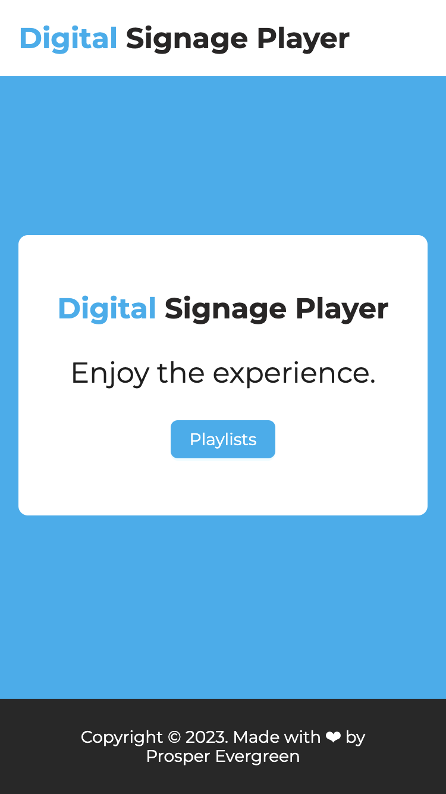
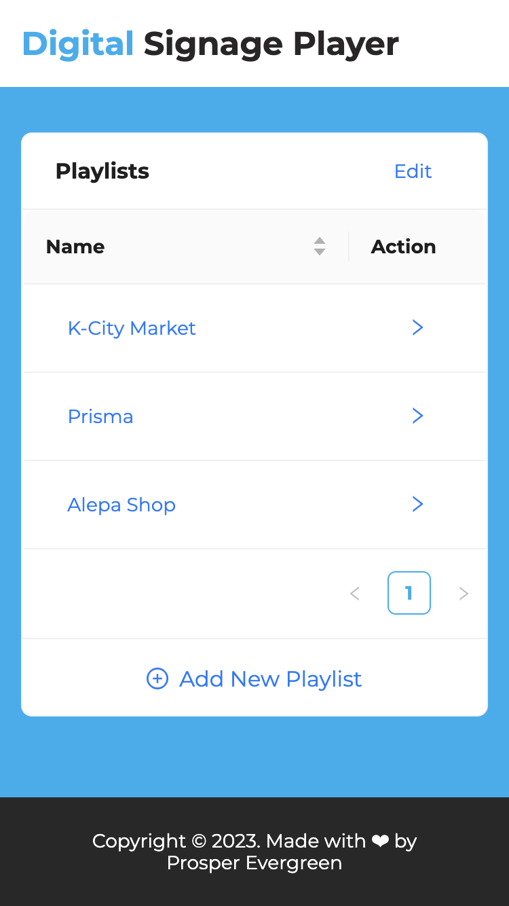
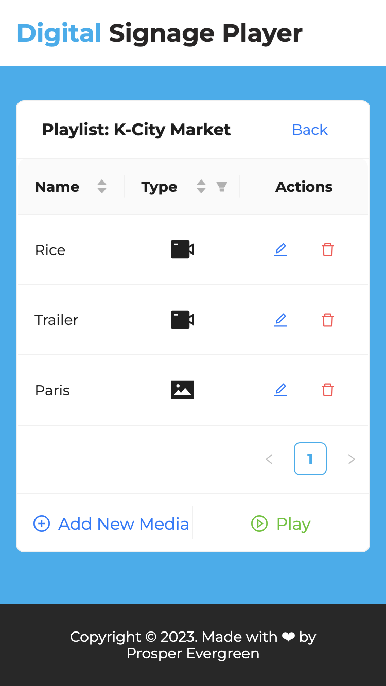
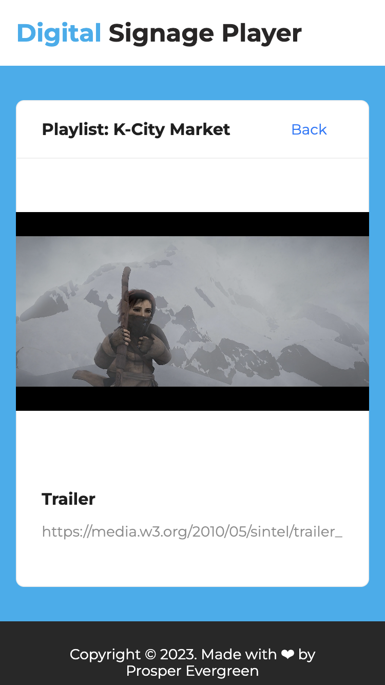
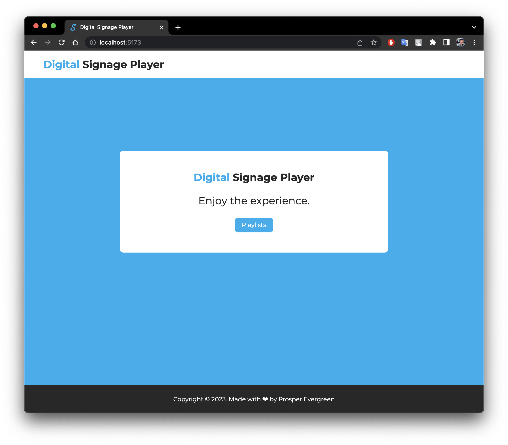
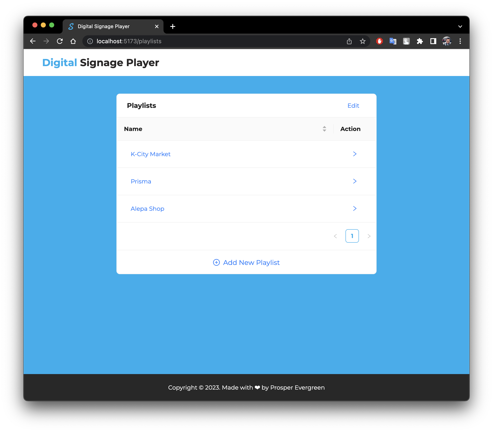
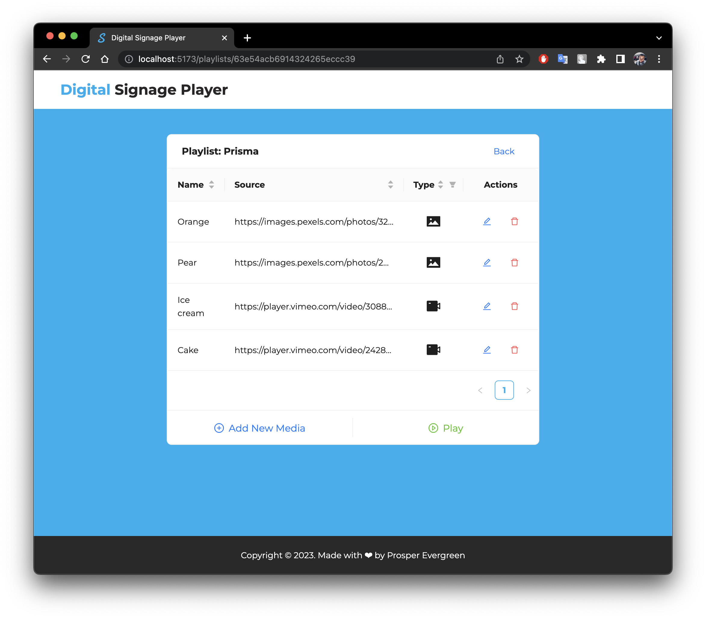
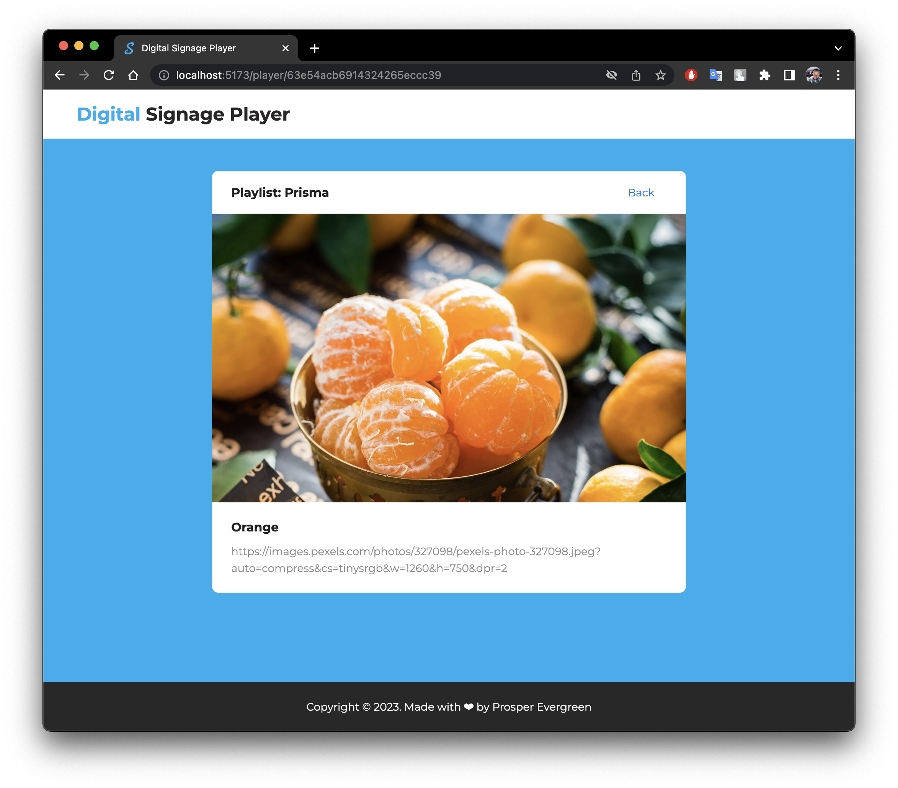

# Digital Signage Player

A Digital Signage Player is a player that allows user manager several mangage playlist and media urls.

It is developed with [Mongodb](https://www.mongodb.com/), [Express](https://expressjs.com/), [React](https://reactjs.org/) and [Node](https://nodejs.org/en/) **(MERN)** Stack. The app runs on `http://localhost:80`.

---

**Note: Before you follow the setup instructions, be sure you have [Docker](https://www.docker.com/) and [Docker Compose](https://docs.docker.com/compose/) installed and running in your environment.**

## SETUP INSTRUCTION

To run the app,

1. Clone the repository `git clone https://gitlab.com/prosperevergreen/digital-signage-player`
2. Move into the folder with the command `cd digital-signage-palyer`
3. In the the root directory `digital-signage-player`, start the app with the command `docker-compose up -d` you can now view the app on a browser at `http://localhost:80`
4. In the the root directory `digital-signage-player`, to stop the app use the command `docker-compose down`

---

## MOBILE SCREENSHOT

  
  
  
  

---

## MOBILE DEMO VIDEO

There is also a [MOBILE DEMO VIDEO](./documentation/recording/mobile-recording.mov)

  <video controls width="340" height="650">
    <source src="./documentation/recording/mobile-recording.mov" type="video/mp4">
  </video>

## DESKTOP SCREENSHOT

  
  
  
  

---

## DESKTOP VIDEO

There is also a [DESKTOP DEMO VIDEO](./documentation/recording/desktop-recording.mp4)

  <video width="1080" height="850" controls>
    <source src="./documentation/recording/desktop-recording.mp4" type="video/mp4">
  </video>

## Additional questions related to the task

1. How did you implement the content looping for the Digital Signage player? What
   challenges did you face?

   - I used a ready made carusel component from antd to implemenet the loop. However, I could loop through an array of `src`s using mod of the length of the array while using a setInterval to periodically move to next media item. Alternatively, I could check when I am at the end of the array with `index === arr.length` and then moving to the first item.

2. Why did you choose the actual UI design you implemented?

   - I used a simple and intuitive UI for the applcation to allow users achieve their goal without needing guidlines.

3. If you support playing video content, how do you know when to play the next content
   after the video has reached the end?

   - Yes, I supported the display of videos. I used the `onEnded` event to figure out when the video has ended.

4. What backend technologies did you use and why? What advantages do your chosen
   technologies have? What possible disadvantages do they have?

   - I used `mongodb`, `mongoose` and `express` for the backend.
